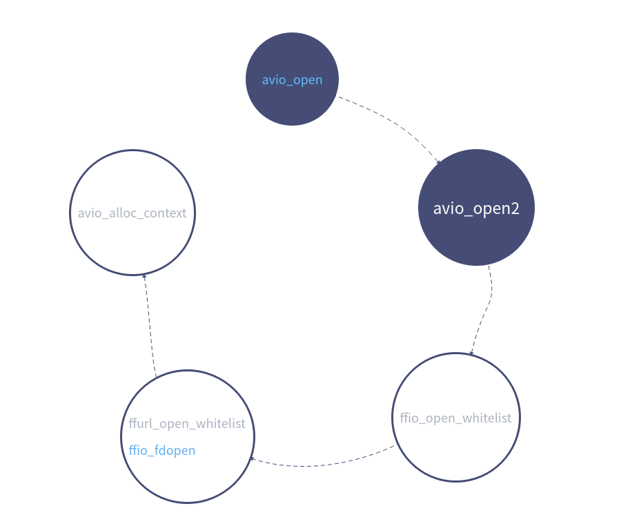

## `ffmpeg`日志

`ffmpeg`日志，接口都定义在`log.h`，使用的库是`libavutil`

使用时一定要加上对头文件`extern "C"`外部，否则会报对应的函数没有定义

```cpp
//
// Created by andrew on 2020/10/31.
//
#include <iostream>
extern "C"{
#include <libavutil/log.h>
}

using namespace std;

int main(int argc, char *argv[])
{
    av_log_set_level(AV_LOG_DEBUG);
    av_log(NULL, AV_LOG_DEBUG,"Hello world!\n");

    return 0;
}
```

执行结果：

```bash
Hello world!
```


## `write file`

第一步先设置日志等级，这里追溯下日志等级设置的实现。

### `av_log_set_level`设置日志等级

前期追溯过的函数后面将不会进行重复追踪定位。

`av_log_set_level(AV_LOG_DEBUG);`函数点击进入函数，函数实现如下，只是设置了一个全局变量，用于记录日志的等级

```cpp
void av_log_set_level(int level)
{
    av_log_level = level;
}
```

再看下实际使用时，函数是如何判定日志是否需要输出的

```cpp
void av_log(void* avcl, int level, const char *fmt, ...)
{
    va_list vl;
    va_start(vl, fmt);
    av_vlog(avcl, level, fmt, vl);
    va_end(vl);
}
//实际调用
void av_vlog(void* avcl, int level, const char *fmt, va_list vl)
{
    AVClass* avc = avcl ? *(AVClass **) avcl : NULL;
    void (*log_callback)(void*, int, const char*, va_list) = av_log_callback;
    if (avc && avc->version >= (50 << 16 | 15 << 8 | 2) &&
        avc->log_level_offset_offset && level >= AV_LOG_FATAL)
        level += *(int *) (((uint8_t *) avcl) + avc->log_level_offset_offset);
    if (log_callback)
        log_callback(avcl, level, fmt, vl);
}
// 回调函数指针
static void (*av_log_callback)(void*, int, const char*, va_list) =
    av_log_default_callback;

//回调函数
void av_log_default_callback(void* ptr, int level, const char* fmt, va_list vl)
{
    static int print_prefix = 1;
    static int count;
    static char prev[LINE_SZ];
    AVBPrint part[4];
    char line[LINE_SZ];
    static int is_atty;
    int type[2];
    unsigned tint = 0;

    if (level >= 0) {
        tint = level & 0xff00;
        level &= 0xff;
    }
	// 这里是是否输出日志的关键，只有level小于这个等级的时候才会输出日志
    if (level > av_log_level)
        return;
    ff_mutex_lock(&mutex);

    format_line(ptr, level, fmt, vl, part, &print_prefix, type);
    snprintf(line, sizeof(line), "%s%s%s%s", part[0].str, part[1].str, part[2].str, part[3].str);

#if HAVE_ISATTY
    if (!is_atty)
        is_atty = isatty(2) ? 1 : -1;
#endif

    if (print_prefix && (flags & AV_LOG_SKIP_REPEATED) && !strcmp(line, prev) &&
        *line && line[strlen(line) - 1] != '\r'){
        count++;
        if (is_atty == 1)
            fprintf(stderr, "    Last message repeated %d times\r", count);
        goto end;
    }
    if (count > 0) {
        fprintf(stderr, "    Last message repeated %d times\n", count);
        count = 0;
    }
    strcpy(prev, line);
    sanitize(part[0].str);
    colored_fputs(type[0], 0, part[0].str);
    sanitize(part[1].str);
    colored_fputs(type[1], 0, part[1].str);
    sanitize(part[2].str);
    colored_fputs(av_clip(level >> 3, 0, NB_LEVELS - 1), tint >> 8, part[2].str);
    sanitize(part[3].str);
    colored_fputs(av_clip(level >> 3, 0, NB_LEVELS - 1), tint >> 8, part[3].str);

#if CONFIG_VALGRIND_BACKTRACE
    if (level <= BACKTRACE_LOGLEVEL)
        VALGRIND_PRINTF_BACKTRACE("%s", "");
#endif
end:
    av_bprint_finalize(part+3, NULL);
    ff_mutex_unlock(&mutex);
}
```

实际日志等级的定义

```cpp

/**
 * Print no output.
 */
#define AV_LOG_QUIET    -8

/**
 * Something went really wrong and we will crash now.
 */
#define AV_LOG_PANIC     0

/**
 * Something went wrong and recovery is not possible.
 * For example, no header was found for a format which depends
 * on headers or an illegal combination of parameters is used.
 */
#define AV_LOG_FATAL     8

/**
 * Something went wrong and cannot losslessly be recovered.
 * However, not all future data is affected.
 */
#define AV_LOG_ERROR    16

/**
 * Something somehow does not look correct. This may or may not
 * lead to problems. An example would be the use of '-vstrict -2'.
 */
#define AV_LOG_WARNING  24

/**
 * Standard information.
 */
#define AV_LOG_INFO     32

/**
 * Detailed information.
 */
#define AV_LOG_VERBOSE  40

/**
 * Stuff which is only useful for libav* developers.
 */
#define AV_LOG_DEBUG    48

/**
 * Extremely verbose debugging, useful for libav* development.
 */
#define AV_LOG_TRACE    56
```

一般设置的时候我们会将日志打印等级设置为`AV_LOG_DEBUG`，这个等级非常大很少有大于这个等级的日志宏定义，因此在实际中设置这个等级大多数打印都会打印出来。

### 取出要写的文件名字

```c
char *pSrcFileName = argv[1];
```

### 构建`AVIOContext`结构体

使用`avio_open`函数构建`AVIOContext`结构体

看下`avio_open`函数的调用关系



```c
1. avio_open 函数调用了 avio_open2
/**
 * Create and initialize a AVIOContext for accessing the
 * resource indicated by url.
 * @note When the resource indicated by url has been opened in
 * read+write mode, the AVIOContext can be used only for writing.
 *
 * @param s Used to return the pointer to the created AVIOContext.
 * In case of failure the pointed to value is set to NULL.
 * @param url resource to access
 * @param flags flags which control how the resource indicated by url
 * is to be opened
 * @return >= 0 in case of success, a negative value corresponding to an
 * AVERROR code in case of failure
 */
int avio_open(AVIOContext **s, const char *url, int flags);

2. avio_open函数调用了ffio_open_whitelist
3. ffio_open_whitelist函数调用了ffurl_open_whitelist 和ffio_fdopen
4. ffio_fdopen函数调用了 avio_alloc_context
/**
 * Allocate and initialize an AVIOContext for buffered I/O. It must be later
 * freed with avio_context_free().
 *
 * @param buffer Memory block for input/output operations via AVIOContext.
 *        The buffer must be allocated with av_malloc() and friends.
 *        It may be freed and replaced with a new buffer by libavformat.
 *        AVIOContext.buffer holds the buffer currently in use,
 *        which must be later freed with av_free().
 * @param buffer_size The buffer size is very important for performance.
 *        For protocols with fixed blocksize it should be set to this blocksize.
 *        For others a typical size is a cache page, e.g. 4kb.
 * @param write_flag Set to 1 if the buffer should be writable, 0 otherwise.
 * @param opaque An opaque pointer to user-specific data.
 * @param read_packet  A function for refilling the buffer, may be NULL.
 *                     For stream protocols, must never return 0 but rather
 *                     a proper AVERROR code.
 * @param write_packet A function for writing the buffer contents, may be NULL.
 *        The function may not change the input buffers content.
 * @param seek A function for seeking to specified byte position, may be NULL.
 *
 * @return Allocated AVIOContext or NULL on failure.
 */
AVIOContext *avio_alloc_context(
                  unsigned char *buffer,
                  int buffer_size,
                  int write_flag,
                  void *opaque,
                  int (*read_packet)(void *opaque, uint8_t *buf, int buf_size),
                  int (*write_packet)(void *opaque, uint8_t *buf, int buf_size),
                  int64_t (*seek)(void *opaque, int64_t offset, int whence));
```

### 将数据写入文件

`avio_write`将传入的`buff`写入到`AVIOContext`关联的结构体中

```c


void avio_write(AVIOContext *s, const unsigned char *buf, int size)
{
    if (s->direct && !s->update_checksum) {
        avio_flush(s);
        writeout(s, buf, size);
        return;
    }
    // 循环将传入的buf 字符串写入到s中的buf缓冲区中
    while (size > 0) {
        int len = FFMIN(s->buf_end - s->buf_ptr, size);
        memcpy(s->buf_ptr, buf, len);
        s->buf_ptr += len;

        if (s->buf_ptr >= s->buf_end)
            flush_buffer(s);

        buf += len;
        size -= len;
    }
}
```

### 释放申请的资源

使用`avio_close`释放申请的资源

### 代码实现如下


```cpp
//
// Created by andrew on 2020/11/7.
//

#include <iostream>

extern "C" {
#include <libavutil/log.h>
#include <libavformat/avio.h>
}

using namespace std;

int main(int argc, char *argv[]) {

    //  设置日志等级
    av_log_set_level(AV_LOG_DEBUG);
    if (argc < 2) {
        av_log(NULL, AV_LOG_ERROR, "The count of parameter should be more than two!\n");
        exit(1);
    }

    char *pSrcFileName = argv[1];
    if (NULL == pSrcFileName) {
        av_log(NULL, AV_LOG_ERROR, "invalid src filename.\n");
        exit(2);
    }

    AVIOContext *avioCtx = NULL;
    int errCode = -1;
    /*
     * Create and initialize a AVIOContext for accessing the
     * resource indicated by url.
     * */
    if ((errCode = avio_open(&avioCtx, pSrcFileName, AVIO_FLAG_WRITE)) < 0) {
        av_log(NULL, AV_LOG_ERROR, "Coud not open file %s\n", pSrcFileName);
        exit(3);
    }
    string strBuff = "hello world!\n";

    avio_write(avioCtx, (const unsigned char *)(strBuff.c_str()), strBuff.length());

    avio_close(avioCtx);

    char tempBuff[128];
    snprintf(tempBuff, sizeof(tempBuff), "cat %s", pSrcFileName);

    system(tempBuff);
    snprintf(tempBuff, sizeof(tempBuff), "rm %s", pSrcFileName);

    system(tempBuff);
    return 0;
}
```


```bash
#运行结果，编译时连接上对应的库文件
./ffmpeg_io_write test.txt
hello world!

```

## `read file`

读文件和写文件实现基本上一样，需要改动的点是，打开文件时，将标志设置为`AVIO_FLAG_READ`并将`avio_write`修改为`avio_read`函数。

代码实现如下：

```cpp
//
// Created by andrew on 2020/11/8.
//

//
// Created by andrew on 2020/11/7.
//

#include <iostream>

extern "C" {
#include <libavutil/log.h>
#include <libavformat/avio.h>
}

using namespace std;

int main(int argc, char *argv[]) {
    char tempBuff[128];
    //  设置日志等级
    av_log_set_level(AV_LOG_DEBUG);
    if (argc < 2) {
        av_log(NULL, AV_LOG_ERROR, "The count of parameter should be more than two!\n");
        exit(1);
    }

    char *pSrcFileName = argv[1];
    if (NULL == pSrcFileName) {
        av_log(NULL, AV_LOG_ERROR, "invalid src filename.\n");
        exit(2);
    }

    // 创建一个文件
    snprintf(tempBuff, sizeof(tempBuff), "echo \"hello world!\n \" > %s", pSrcFileName);
    system(tempBuff);

    AVIOContext *avioCtx = NULL;
    int errCode = -1;
    /*
     * Create and initialize a AVIOContext for accessing the
     * resource indicated by url.
     * */
    if ((errCode = avio_open(&avioCtx, pSrcFileName, AVIO_FLAG_READ)) < 0) {
        av_log(NULL, AV_LOG_ERROR, "Coud not open file %s\n", pSrcFileName);
        exit(3);
    }
    unsigned char strBuff[1024];
    avio_read(avioCtx, strBuff, sizeof(strBuff));

    avio_close(avioCtx);

    av_log(NULL, AV_LOG_DEBUG, "read file content:%s", strBuff);
    memset(tempBuff, 0, sizeof(tempBuff));
    snprintf(tempBuff, sizeof(tempBuff), "rm %s", pSrcFileName);
    system(tempBuff);
    return 0;
}
```

执行结果如下：

```bash
./ffmpeg_io_read test.txt
read file content:hello world!
```


## 获取`mediainfo`

### 首先调用`av_register_all`将所有的编码器和解码器注册好

来看下具体的注册实现

```cpp
void av_register_all(void)
{
    ff_thread_once(&av_format_next_init, av_format_init_next);
}
// 看下av_format_init_next的实现
// 可以看到函数内部是实现了将编码器和解码器使用指针进行串联的操作
// 如果有输出或者输入列表，将输出或输入列表也进行串联
static void av_format_init_next(void)
{
    AVOutputFormat *prevout = NULL, *out;
    AVInputFormat *previn = NULL, *in;

    ff_mutex_lock(&avpriv_register_devices_mutex);
	// 编码器串联
    for (int i = 0; (out = (AVOutputFormat*)muxer_list[i]); i++) {
        if (prevout)
            prevout->next = out;
        prevout = out;
    }
	//实现输出列表的串联
    if (outdev_list) {
        for (int i = 0; (out = (AVOutputFormat*)outdev_list[i]); i++) {
            if (prevout)
                prevout->next = out;
            prevout = out;
        }
    }
	//实现解码器的串联
    for (int i = 0; (in = (AVInputFormat*)demuxer_list[i]); i++) {
        if (previn)
            previn->next = in;
        previn = in;
    }
	//实现输入列表的串联
    if (indev_list) {
        for (int i = 0; (in = (AVInputFormat*)indev_list[i]); i++) {
            if (previn)
                previn->next = in;
            previn = in;
        }
    }

    ff_mutex_unlock(&avpriv_register_devices_mutex);
}

```


### 调用`avformat_open_input`

调用 `avformat_open_input`根据输入的音视频内容构造 `AVFormatContext`结构体，函数功能如下：

```c
/**
	打开一个流，并读取头部信息
 * Open an input stream and read the header. The codecs are not opened.
 * The stream must be closed with avformat_close_input().
 *  ps可以用户提供，如果为NULL该函数会进行内存申请
 * @param ps Pointer to user-supplied AVFormatContext (allocated by avformat_alloc_context).
 *           May be a pointer to NULL, in which case an AVFormatContext is allocated by this
 *           function and written into ps.
 *           Note that a user-supplied AVFormatContext will be freed on failure.
  指向要打开的多媒体文件
 * @param url URL of the stream to open.
   不指定，使用自动侦测
 * @param fmt If non-NULL, this parameter forces a specific input format.
 *            Otherwise the format is autodetected.
 * @param options  A dictionary filled with AVFormatContext and demuxer-private options.
 *                 On return this parameter will be destroyed and replaced with a dict containing
 *                 options that were not found. May be NULL.
 *
 * @return 0 on success, a negative AVERROR on failure.
 *
 * @note If you want to use custom IO, preallocate the format context and set its pb field.
 */
int avformat_open_input(AVFormatContext **ps, const char *url, ff_const59 AVInputFormat *fmt, AVDictionary **options);
```

### 调用`av_dump_format`打印文件信息

```c
/**
 * Print detailed information about the input or output format, such as
 * duration, bitrate, streams, container, programs, metadata, side data,
 * codec and time base.
 *
 * @param ic        the context to analyze
 * @param index     index of the stream to dump information about
 * @param url       the URL to print, such as source or destination file
 * @param is_output Select whether the specified context is an input(0) or output(1)
 */
void av_dump_format(AVFormatContext *ic,
                    int index,
                    const char *url,
                    int is_output);
```

调用`av_dump_format(pFmtCtx, 0, pSrcName, 0);`实现对基本信息的打印，这里为了方便观看，可以自己实现一个函数，对多媒体数据进行打印。

这为了更好理解媒体信息记录的格式，自己实现了一个简单的打印接口，仅用于参考

```c
//
// Created by andrew on 2020/11/8.
//

#include <iostream>
#include <string>
extern "C" {
#include <libavformat/avformat.h>
#include <libavutil/log.h>
#include <libavutil/dict.h>
}
using namespace std;

// 声明一下 因为原函数是在.c中声明的结构体
struct AVDictionary {
    int count;
    AVDictionaryEntry *elems;
};

// 打印媒体信息的简单示例
void my_av_input_dump_format(AVFormatContext *ic, int index,
                    const char *url, int is_output){

    string pSrt = (is_output != 0) ? "output":"input";
    cout << "音视频输入输出类型：" << pSrt <<endl;
    cout << "index = " << index << endl;
    if(is_output){
        cout << "fromat name:" << ic->oformat->name << endl;
    }else
        cout << "fromat name:" << ic->iformat->name << endl;
    // url
    cout << "from :" << url << endl;

    //ic->metadata
    int i = 0;
    i =  ic->metadata->count;
    for (i = 0; i < ic->metadata->count; i++){
        cout << "    " <<ic->metadata->elems[i].key << ":" <<ic->metadata->elems[i].value << endl;
    }
}

int main(int argc, char *argv[]){

//    设置日志等级
    av_log_set_level(AV_LOG_DEBUG);
    if(argc< 2)
    {
        av_log(NULL, AV_LOG_ERROR, "you should input media file!\n");
        return -1;
    }
//    所有获取音视频信息都要首先注册
    av_register_all();
    int errCode = -1;
    AVFormatContext *pFmtCtx = NULL;
    const char *pSrcName = argv[1];
    if((errCode = avformat_open_input(&pFmtCtx, pSrcName, NULL, NULL)) < 0){
        av_log(NULL, AV_LOG_ERROR, "avformat open input failed.\n");
        exit(1);
    }
    //官方接口
//    av_dump_format(pFmtCtx, 0, pSrcName, 0);
    my_av_input_dump_format(pFmtCtx, 0, pSrcName, 0);
    //释放资源
    avformat_close_input(&pFmtCtx);

    return 0;
}
```

执行输出结果：

```bash
音视频输入输出类型：input
index = 0
fromat name:mov,mp4,m4a,3gp,3g2,mj2
from :/work/test/test.mp4
    major_brand:isom
    minor_version:512
    compatible_brands:isomiso2avc1mp41
    track:0
    artist:段奥娟
    album:
    comment:163 key(Don't modify):ZWxeTBkln0EQUjdDVUZQXrJzMh33POt0FgWTvjgge2X8BzXmyZaXb9C8+H2VGrdLG7XRTMrkXzzfV9VNH7sp0KlFimbjkVbsWksXY5YrzqFNXeJX1gvrBWCV+m3aYddkvy0HxucdcxCoCrYsrnzxL97sgxi0M2VHh6PREC3j6Uz4hfWkIMGhul9aszAuzEvbUUIQXSZRHgpkVW3g3oTEwqY5CexOWMIgIZAjlFIMxafAnGU8ujxA+ufq/l/r+dQMW9OmRQVt2n4Gz1t83TrPZg==
    title:元気满分
    encoder:Lavf57.71.100
[AVIOContext @ 0x55bf28f2d080] Statistics: 200364 bytes read, 0 seeks
libgcov profiling error:/work/ffmpeg_doc/cmake-build-debug-coverage/src/CMakeFiles/ffmpeg_mediainfo.dir/ffmpeg_avformat/ffmpeg_mediainfo.cpp.gcda:overwriting an existing profile data with a different timestamp

```


## 抽取音频文件

### 注册`log`与编解码器

`av_log_set_level(AV_LOG_INFO);`

`av_register_all();`

### 打开多媒体文件

打开多媒体文件，并读取头部信息

```c
/**
 * Open an input stream and read the header. The codecs are not opened.
 * The stream must be closed with avformat_close_input().
 *
 * @param ps Pointer to user-supplied AVFormatContext (allocated by avformat_alloc_context).
 *           May be a pointer to NULL, in which case an AVFormatContext is allocated by this
 *           function and written into ps.
 *           Note that a user-supplied AVFormatContext will be freed on failure.
 * @param url URL of the stream to open.
 * @param fmt If non-NULL, this parameter forces a specific input format.
 *            Otherwise the format is autodetected.
 * @param options  A dictionary filled with AVFormatContext and demuxer-private options.
 *                 On return this parameter will be destroyed and replaced with a dict containing
 *                 options that were not found. May be NULL.
 *
 * @return 0 on success, a negative AVERROR on failure.
 *
 * @note If you want to use custom IO, preallocate the format context and set its pb field.
 */
int avformat_open_input(AVFormatContext **ps, const char *url, ff_const59 AVInputFormat *fmt, AVDictionary **options);
```

```c
/*Open an input stream and read the header*/
int ret = avformat_open_input(&fmt_ctx, "/work/test/test.mp4", NULL, NULL);
if (ret < 0) {
    av_log(NULL, AV_LOG_ERROR, "can't open file.\n");
    return -1;
}
```

### 打开一个文件用于写入音频文件

```c
char *pDst = NULL;
pDst = "test.aac";
//  write audio data to AAC file
FILE *dst_fd = fopen(pDst, "wb");
if (dst_fd == NULL) {
    av_log(NULL, AV_LOG_ERROR, "open dst_fd failed.\n");
    avformat_close_input(&fmt_ctx);
    return -1;
}
```

### 输出多媒体信息

输出多媒体信息就是讲多媒体的信息以及`metadata`信息打印出来

```c
/*
 * Print detailed information about the input or output format
 **/
av_dump_format(fmt_ctx, 0, "/work/test/test.mp4", 0);
```

### 确保输入的多媒体文件中有帧信息

```c
  // 2. get stream
/*Read packets of a media file to get stream information.*/
ret = avformat_find_stream_info(fmt_ctx, NULL);
if (ret < 0) {
    av_log(NULL, AV_LOG_ERROR, "failed to find stream information.");
    avformat_close_input(&fmt_ctx);
    fclose(dst_fd);
    return -1;
}
```

### 提取音频信息

提取音频信息，并按照AAC格式将音频信息写入文件

```c
AVPacket pkt;
/*Initialize optional fields of a packet with default values.*/
av_init_packet(&pkt);
pkt.data = NULL;
pkt.size = 0;
// 循环将音频信息写入AAC文件
int len = -1;
/*保存原始数据，播放时需要添加AAC的音频格式说明的头*/
while (av_read_frame(fmt_ctx, &pkt) >= 0) {
    if (pkt.stream_index == audio_index) {
        /*每帧开头都要写*/
        char adts_header_buf[7];
        // 为每帧音频添加AAC头部信息
        adts_header(adts_header_buf, pkt.size);
        fwrite(adts_header_buf, 1, 7, dst_fd);
        len = fwrite(pkt.data, 1, pkt.size, dst_fd);
        cout << pkt.size << endl;
        if (len != pkt.size) {
            av_log(NULL, AV_LOG_ERROR, "waning, length is not equl size of pkt.\n");
            return -1;
        }
    }
    /*Wipe the packet.*/
    av_packet_unref(&pkt);
}
```

```c
// 添加ADTS头部信息
void adts_header(char *szAdtsHeader, int dataLen) {

    int audio_object_type = 2;
    int sampling_frequency_index = 7;
    int channel_config = 2;

    int adtsLen = dataLen + 7;

    szAdtsHeader[0] = 0xff;         //syncword:0xfff                          高8bits
    szAdtsHeader[1] = 0xf0;         //syncword:0xfff                          低4bits
    szAdtsHeader[1] |= (0 << 3);    //MPEG Version:0 for MPEG-4,1 for MPEG-2  1bit
    szAdtsHeader[1] |= (0 << 1);    //Layer:0                                 2bits
    szAdtsHeader[1] |= 1;           //protection absent:1                     1bit

    szAdtsHeader[2] =
            (audio_object_type - 1) << 6;            //profile:audio_object_type - 1                      2bits
    szAdtsHeader[2] |=
            (sampling_frequency_index & 0x0f) << 2; //sampling frequency index:sampling_frequency_index  4bits
    szAdtsHeader[2] |= (0 << 1);                             //private bit:0                                      1bit
    szAdtsHeader[2] |=
            (channel_config & 0x04) >> 2;           //channel configuration:channel_config               高1bit

    szAdtsHeader[3] = (channel_config & 0x03) << 6;     //channel configuration:channel_config      低2bits
    szAdtsHeader[3] |= (0 << 5);                      //original：0                               1bit
    szAdtsHeader[3] |= (0 << 4);                      //home：0                                   1bit
    szAdtsHeader[3] |= (0 << 3);                      //copyright id bit：0                       1bit
    szAdtsHeader[3] |= (0 << 2);                      //copyright id start：0                     1bit
    szAdtsHeader[3] |= ((adtsLen & 0x1800) >> 11);           //frame length：value   高2bits

    szAdtsHeader[4] = (uint8_t) ((adtsLen & 0x7f8) >> 3);     //frame length:value    中间8bits
    szAdtsHeader[5] = (uint8_t) ((adtsLen & 0x7) << 5);       //frame length:value    低3bits
    szAdtsHeader[5] |= 0x1f;                                 //buffer fullness:0x7ff 高5bits
    szAdtsHeader[6] = 0xfc;
}

```

[AAC说明可以参考]: https://blog.csdn.net/leixiaohua1020/article/details/50535042

### 结束释放资源

音频写好之后，释放掉申请的资源

```c
/*Close an opened input AVFormatContext*/
avformat_close_input(&fmt_ctx);
if (dst_fd != NULL)
    fclose(dst_fd);
```


```bash
2 packets transmitted, 2 received, 0% packet loss, time 1002ms
rtt min/avg/max/mdev = 13.310/30.905/48.501/17.595 ms
andrew@andrew-G3-3590:~/下载$ sudo apt-get upgrade
正在读取软件包列表... 完成
正在分析软件包的依赖关系树       
正在读取状态信息... 完成       
您也许需要运行“apt --fix-broken install”来修正上面的错误。
下列软件包有未满足的依赖关系：
 gir1.2-freedesktop : 依赖: gir1.2-glib-2.0 (= 1.64.1-1~ubuntu20.04.1) 但是 1.42.0-2.2 已经安装
 gnome-shell : 依赖: gir1.2-glib-2.0 (>= 1.56.0) 但是 1.42.0-2.2 已经安装
               推荐: ibus
 python3-gi : 依赖: gir1.2-glib-2.0 (>= 1.48.0) 但是 1.42.0-2.2 已经安装
E: 有未能满足的依赖关系。请尝试不指明软件包的名字来运行“apt --fix-broken install”(也可以指定一个解决办法)。
andrew@andrew-G3-3590:~/下载$ sudo apt --fix-broken install
正在读取软件包列表... 完成
正在分析软件包的依赖关系树       
正在读取状态信息... 完成       
正在修复依赖关系... 完成
将会同时安装下列软件：
  gir1.2-glib-2.0
下列软件包将被升级：
  gir1.2-glib-2.0
升级了 1 个软件包，新安装了 0 个软件包，要卸载 0 个软件包，有 84 个软件包未被升级。
需要下载 134 kB 的归档。
解压缩后会消耗 57.3 kB 的额外空间。
您希望继续执行吗？ [Y/n] y
获取:1 http://mirrors.aliyun.com/ubuntu focal-updates/main amd64 gir1.2-glib-2.0 amd64 1.64.1-1~ubuntu20.04.1 [134 kB]
已下载 134 kB，耗时 5秒 (25.5 kB/s)     
(正在读取数据库 ... 系统当前共安装有 293973 个文件和目录。)
准备解压 .../gir1.2-glib-2.0_1.64.1-1~ubuntu20.04.1_amd64.deb  ...
正在解压 gir1.2-glib-2.0:amd64 (1.64.1-1~ubuntu20.04.1) 并覆盖 (1.42.0-2.2) ...
正在设置 gir1.2-glib-2.0:amd64 (1.64.1-1~ubuntu20.04.1) ...


andrew@andrew-G3-3590:~/下载$ sudo dpkg -i gir1.2-glib-2.0_1.42.0-2.2_amd64.deb [sudo] andrew 的密码： 
dpkg: 警告: 即将把 gir1.2-glib-2.0:amd64 从 1.64.1-1~ubuntu20.04.1 降级到 1.42.0-2.2
(正在读取数据库 ... 系统当前共安装有 293968 个文件和目录。)
准备解压 gir1.2-glib-2.0_1.42.0-2.2_amd64.deb  ...
正在解压 gir1.2-glib-2.0:amd64 (1.42.0-2.2) 并覆盖 (1.64.1-1~ubuntu20.04.1) ...
正在设置 gir1.2-glib-2.0:amd64 (1.42.0-2.2) ...
andrew@andrew-G3-3590:~/下载$ sudo dpkg rm --
--abort-after                  --path-exclude=
--add-architecture             --path-include=
--admindir=                    --predep-package
--assert-                      --print-architecture
--audit                        --print-avail
--auto-deconfigure             --print-foreign-architectures
--clear-avail                  --purge
--clear-selections             --record-avail
--compare-versions             --refuse-downgrade
--configure                    --remove
--debug=                       --remove-architecture
--field                        --root=
--force-                       --search
--force-help                   --selected-only
--forget-old-unavail           --set-selections
--get-selections               --skip-same-version
--help                         --status
--ignore-depends=              --status-fd
--install                      --status-logger=


-------


apt-get remove gstreamer0.8-misc
然后，再

apt-get -f install

 

sudo apt-get update
sudo apt-get upgrade
然后按照提示执行。
sudo apt-get -f upgrade
```


