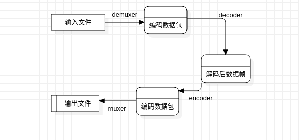
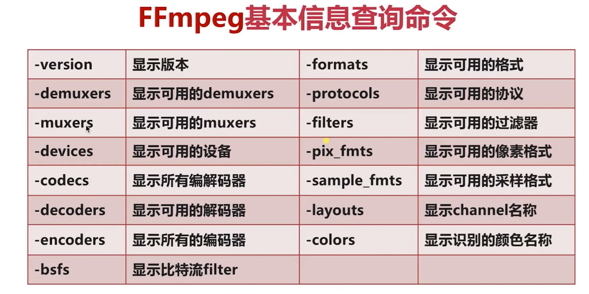
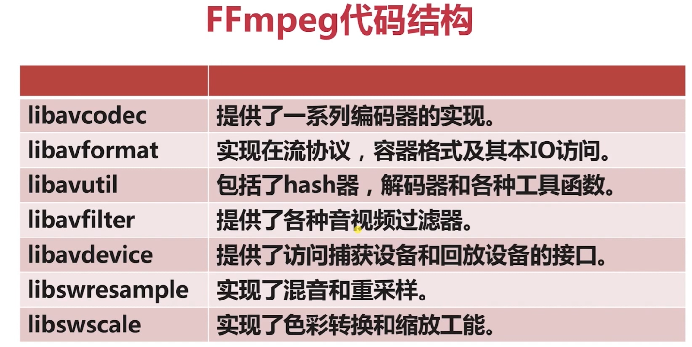

## ffmpeg常用命令

**常用命令分类**


`ffmpeg`处理流程




### 基本信息查询



如命令行：

```bash
ffmpeg -codecs
```

### 录制命令

**`UBUNTU`上录制mp4的命令**

```bash
ffmpeg -thread_queue_size 128 -f x11grab -video_size 1280x800 -framerate 30 -i :0.0 -f video4linux2 -video_size 400x300 -framerate 30 -i /dev/video0 -f alsa -ac 2  -i pulse -filter_complex '[0:v][1:v]overlay=x=main_w-overlay_w-10:y=main_h-overlay_h-10[out]' -map '[out]' -map 2:a  -vcodec libx264 -acodec ac3 test.mp4
```

**播放音频**

```bash
#播放音频文件  播放过程中按w键能够显示音频波形图
ffplay test.mp3
```

**循环播放**

```bash
ffplay pm.mp4 -loop 10
```

**播放完之后退出**

```bash
ffplay -autoexit pm.mp4
```

**设置播放窗口标题**

```bash
ffplay -window_title test -loop 2 pm.mp4
```

### 多媒体格式转换

**将mp4转换为flv文件**

```bash
ffmpeg -i input.mp4 output.flv
```

### 处理原始数据命令

音频原始数据--`pcm`

视频原始数据--`yuv`

将当前`mp4`数据生成原始`yuv`数据

```bash
ffmpeg -i test.mp4 -an -c:v rawvideo -pix_fmt yuv420p ffmout.yuv
```

因为原始数据`yuv`中没有宽高的信息，使用`ffplay`播放的时候需要指定宽度

```bash
ffplay -s 1280x800 ffmout.yuv
```

**提取原始音频**

```bash
ffmpeg -i mkwqianfeng.mp4 -vn -ar 44100 -ac 2 -f s16le omkwqianfeng.pcm
```

```bash
-vn : video no
-ac 2:双声道
-f s16le： 有符号 16 位大小表示， little end
```

播放对应的原始音频

```bash
ffplay -ar 44100 -ac 2 -f s16le omkwqianfeng.pcm
```

### 滤镜命令

**裁剪命令**

```bash
# -vf : video f filter 
# crop : 裁剪命令
# in_w-400 宽度减去 400 默认以中间为中心，总有两边进行裁剪，上下同理， 可以选定xy指定裁剪中心
# -c:v  -- c编码方式 v视频  
# -c:a -- 音频编码方式
ffmpeg -i mkwqianfeng.mp4 -vf crop=in_w-400:in_h-200 -c:v libx264 -c:a copy qianfengfilter.mp4
```

**添加水印**

```bash
ffmpeg -i out.mp4  -vf "movie=logo.png,scale=64:48[watermask];[in][watermask] overlay=30:10 [out]" water.mp4
```

**删除水印**

```bash
ffplay -i test.flv -vf delogo=x=806:y=20:w=70:h=80:show=1
```

**视频缩小**

```bash
ffmpeg -i out.mp4 -vf scale=iw/2:-1 scale.mp4
```

**倍速播放**

```bash
ffmpeg -i out.mp4 -filter_complex "[0:v]setpts=0.5*PTS[v];[0:a]atempo=2.0[a]" -map "[v]" -map "[a]" speed2.0.mp4
```

**视频镜像**

```bash
ffmpeg  -i out.mp4 -filter_complex "[0:v]pad=w=2*iw[a];[0:v]hflip[b];[a][b]overlay=x=w" duicheng.mp4
```

**画中画**

```bash
ffmpeg -i out.mp4 -i out1.mp4 -filter_complex "[1:v]scale=w=176:h=144:force_original_aspect_ratio=decrease[ckout];[0:v][ckout]overlay=x=W-w-10:y=0[out]" -map "[out]" -movflags faststart new.mp4
```

**录制画中画**

```bash
ffmpeg  -f avfoundation -i "1" -framerate 30 -f avfoundation -i "0:0" 
-r 30 -c:v libx264 -preset ultrafast 
-c:a libfdk_aac -profile:a aac_he_v2 -ar 44100 -ac 2 
-filter_complex "[1:v]scale=w=176:h=144:force_original_aspect_ratio=decrease[a];[0:v][a]overlay=x=W-w-10:y=0[out]" 
-map "[out]" -movflags faststart -map 1:a b.mp4
```

**多路视频拼接**

```bash
ffmpeg  -f avfoundation -i "1" -framerate 30 -f avfoundation   -i "0:0" -r 30 -c:v libx264 -preset ultrafast -c:a libfdk_aac -profile:a aac_he_v2 -ar 44100 -ac 2 -filter_complex "[0:v]scale=320:240[a];[a]pad=640:240[b];[b][1:v]overlay=320:0[out]" -map "[out]" -movflags faststart  -map 1:a  c.mp4
```


### 裁剪合并命令

```bash
ffmpeg -i mkwqianfeng.mp4 -ss 00:01:10 -t 10 cut.ts
```

**合并**

```bash
# input.txt  要合并的文件列表
ffmpeg -f concat -i input.txt out.flv
```

`input.txt`格式`file`后面跟上对应视频文件名，支持编码的各种视频文件

```bash
andrew@andrew-G3-3590:/work/test$ cat input.txt 
file 'cut.ts'
file 'cut2.ts'
```


### 图片与视频互转命令

**将视频转换为图片**

```bash
# -r 1：每秒生成 一张图片， 图片帧率
# -f image2 : 图片格式是iamge2
# %3d  : 10进制生成图片的序列
ffmpeg -i 元气.mp4 -r 1 -f image2 image-%3d.jpeg
```


### 直播推流与拉流

**拉流**

```bash
# 从指定rtmp网站上拉流，并存储到xxx.flv格式的文件中
ffmpeg -i rtmp://202.69.69.180:443/webcast/bshdlive-pc -c copy rtmptest.flv
```

**推流**

```bash
ffmpeg -re -i out.mp4 -c copy -f flv rtmp://server/live/streamName
```

**转流**

```bash
ffmpeg -i rtmp://server/live/originalStream -c:a copy -c:v copy -f flv rtmp://server/live/h264Stream
```

**实时推流**

```bash
ffmpeg -framerate 15 -f avfoundation -i "1" -s 1280x720 -c:v libx264  -f  flv rtmp://localhost:1935/live/room
```


### `ffplay`

**播放`yuv`数据**

```bash
ffplay -pix_fmt nv12 -s 192x144 1.yuv
```

**播放YUV中的Y平面**

```bash
ffplay -pix_fmt nv21 -s 640x480 -vf extractplanes='y' 1.yuv
```





```bash


./configure --prefix=/usr --enable-gpl --enable-debug

```


